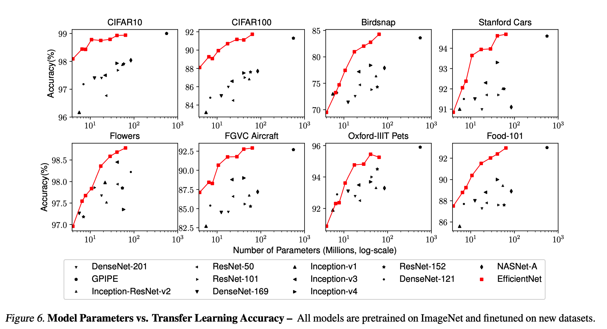

# ConvNets 

## EfficienNet 

### 简介

通过NAS搜索最优width，depth和resolution(input)，在不改变网络结构的情况下，实现很好地acc和flops的权衡。

### 核心要点

#### model scaling

NAS (neural arch search) 的目的，是找到最优的架构。model scaling的目的，是在arch不变的情况下，找到最优的$(L_i,C_i, H_i, W_i)$。这也使得我们更容易地与baseline进行对比

本文使用了一种复合的 scaling method，其实就是加权。

$$depth: d = \alpha^\phi \\ width: \omega = \beta^\phi \\ resolution: r=\gamma^\phi \\  s.t. \alpha*\beta^2*\gamma^2 \approx 2 \\ \alpha>1, \beta>1, \gamma>1$$

此时优化的参数就变成了复合参数$\phi$, 已经三个基础参数 $\alpha, \beta, \gamma$ (可以通过grid search 很容易地找到)。

#### 优化目标

acc and flops : $ ACC(m)\times [FLOPS(m)/T]^\omega $

#### 优化方法

Step1: fix $\phi=1$, 用grid search找到 $\alpha, \beta, \gamma$

Step2：fix $\alpha, \beta, \gamma$， 然后优化 $\phi$

### 结论

1. 增加 width, depth, resolution可以提高acc，但是增加过多没有效果
2. 为了追求更好的acc，需要更好的width，depth和resolution的均衡

### 成果

