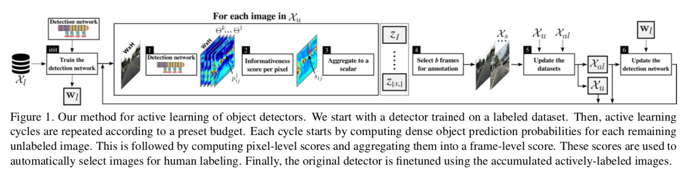
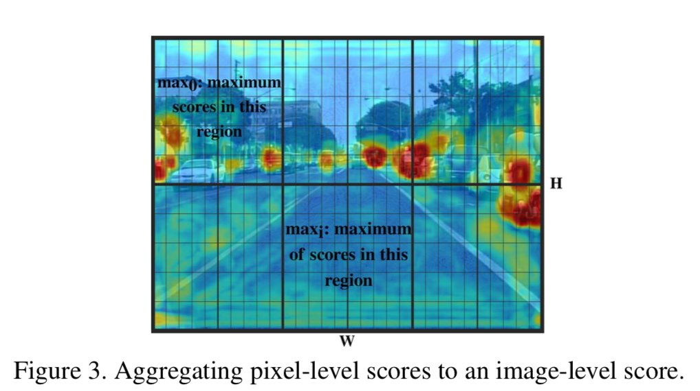

# Uncertainty-based object deteciton acitve learning

## 简介

本文主要介绍几篇(目前是2)基于uncertainty的目标检测主动学习算法的文章。

## 1. Active Learning for Deep Detection Neural Networks

> ICCV2019
>
> https://arxiv.org/pdf/1911.09168.pdf
>
> Hamed H. Aghdam , Abel Gonzalez-Garcia , Joost van de Weijer, Antonio M. Lopez 
>
> Computer Vision Center (CVC)1 and Computer Science Dpt.2 , Univ. Autonoma de Barcelona (UAB) 
>
> {haghdam,agonzalez,joost,antonio}@cvc.uab.es

### 文章概述

- 本文目的：通过active Learning减少FP（误检）和FN（漏检）

- 假设

  对一张图片X，$x_1$ 是它的patch，$x_2$是$x_1$平移$\epsilon$之后的结果，是$x_1$的neighbornood。**如果X在训练集中被模型”见“过足够多的次数，我们可以认为，对$x_2$和$x_1$，检测网络会预测非常类似的概率分布结果。**

- 推论

  如果$x_1$和$x_2$的后验概率$p(x_1|w)$、$p(x_2|w)$差别很大，即$x_1, x_2$中存在FP或者FN，那么$x_1, x_2$所属的图片X需要被挑出来标注并参与新模型训练。此时我们说，$x_1, x_2$的divergence很大，divergence可以被用来建模uncertainty。用$D(\Theta(x_1)||\Theta(x_2))$表示divergence，其中$\Theta()$是softmax函数。

  

  由以上假设，我们可得：对FP和FN样本(图片patch)，它和neighborhood的D会变得非常大。

## Active Learning 详情

active Learning的步骤如上图。

#### uncertainty modeling

- 输入

  - 本文主要使用1阶段检测网络，类似SSD
  - 本文使用objectness检测结果（5个用于回归最后结果的feature map），来计算uncertainty。对行人检测任务来说，这些feature map就是一个二分类结果。
  - **<u>本文不使用bbox 回归分支</u>**

- 如何计算？

  1. 使用一个类似SSD的网络，输出5个resolution的feature map，来预测object

     输入size=WxH的图像，输出5个feature map（论文中叫probability matrix），被记为$\Theta^{k}$。

  

  2. 我们希望计算一个的size=WxH的score matrix S，每个元素$s_{ij}$表示的是它和neighborhood的预测结之间的divergence。

     记$p_{ij}^k$是第k个probability matrix $\Theta^k$在（i,j）位置上的元素，计算它在原图位置（m，n）处的概率分布：

  $$
  \hat{p}_{ij}^k = \frac{1}{(2r+1)^2}\sum_{i=m-r}^{m+r}\sum_{j=n-r}^{n+r}p_{ij}^k
  $$
  其中，**r是neighborhood的半径**

  - 此时（m,n）处对第k个proba matrix的score为：
    $$
    s_{mn}^k = \mathbb{H}(\hat{p}_{mn}^k) - \frac{1}{(2r+1)^2}\sum_{i=m-r}^{m+r}\sum_{j=n-r}^{n+r}\mathbb{H}(p_{ij}^k)
    $$
    其中$\mathbb{H}$是entropy方程：
    $$
    \mathbb{H}(z) = -z\log{z} - (1-z)\log{(1-z)}
    $$

    在做对比实验时，我们也采取MCdropout方法，此时，对2类entropy，
       $s_{mn}^k = \mathbb{H}(\hat{p}_{mn}^k)$ , 

      $s_{mn}^k = \mathbb{H}(\hat{p}_{mn}^k)  - \frac{1}{T}\sum_{t=1}^{T}\mathbb{H}(p_{mn}^k|w,q)$

      其中，q是dropout distribution。与我们不同的是，我们计算局部区域的divergence，MCdropout则是通过T次inference，计算同一位置的divergence。

    - 最后的在**S**上的score为5个proba matrix之和：

  $$
  s_{mn} = \sum_{k=1...K_{\Theta}}s_{mn}^k
  $$

  - 从（3）可以看出，**<u>本文定义score为平均值的entropy减去entropy的平均值</u>**。事实证明，$s_{mn}^k$将会接近0，如果某处的预测结果和它周围很相近。否则，则会很大。
    
      - 最后$s_{mn}$会接近于0，如果在该位置，各个resolution下的预测一致的话
      
      - aggregating score

        

        我们最后希望有一个image-level的score，用于在active learning中对图像进行重要性排序，重要的图片，需要优先标注。如上图所示，我们**把图片分为互不重叠的$D_p$块区域**，定义image-level score 为z，则：
    
    $$
    z = \frac{1}{D_p}\sum_i{s_{max}^i}
    $$
    

## http://bmvc2018.org/contents/papers/0287.pdf